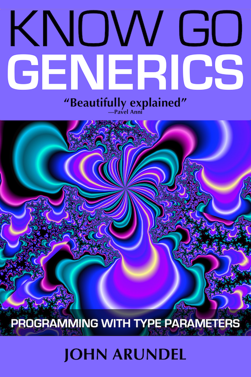

# Know Go: Generics

This repository contains exercises, solutions, and code samples from the book [Know Go: Generics](https://bitfieldconsulting.com/books/generics), by John Arundel.

## 1. Generics

There are no exercises for this chapter. You can relax!

## 2. Type parameters

1. [Hello, generics](exercises/2.1/)
2. [Group therapy](exercises/2.2/)
3. [Lengthy proceedings](exercises/2.3/)

## 3. Constraints

1. [Stringy beans](exercises/3.1/)
2. [Pointy-haired boss](exercises/3.2/)
3. [A first approximation](exercises/3.3/)
4. [Greater love](exercises/3.4/)

## 4. Operations

1. [Product placement](exercises/4.1/)
2. [Duplicate keys](exercises/4.2/)

## 5. Types

1. [Empty promises](exercises/5.1/)

## 6. Functions

1. [Func to funky](exercises/6.1/)
2. [Compose yourself](exercises/6.2/)

## 7. Containers

1. [Stack overflow](exercises/7.1/)

## 8. Concurrency

1. [Channelling frustration](exercises/8.1/)

## 9. Libraries

1. [Contain your excitement](exercises/9.1/)
2. [Merging in turn](exercises/9.2/)

## 10. Questions

There are no exercises for this chapter. Why not enjoy a refreshing cup of tea?
